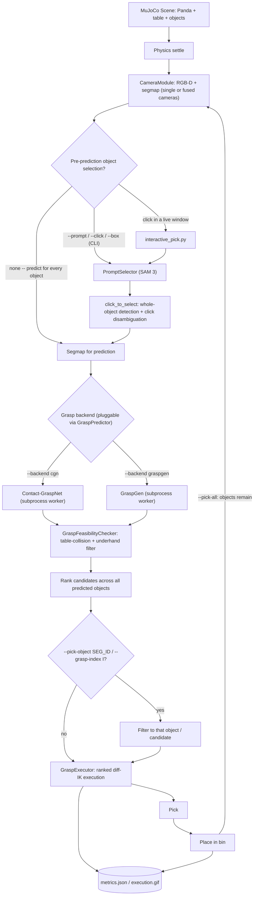
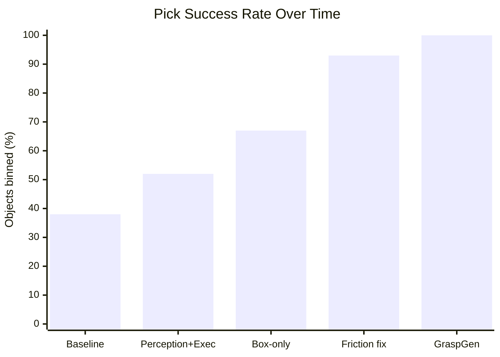

# ContactPilot — Franka Panda Grasping with Contact-GraspNet (PyTorch)

Working setup for grasping **unseen objects** (no CAD models, no markers) with a
Franka Panda + eye-to-hand calibrated RealSense D455f, using
[Contact-GraspNet](https://arxiv.org/abs/2103.14127) via the PyTorch port
[`elchun/contact_graspnet_pytorch`](https://github.com/elchun/contact_graspnet_pytorch).

**Validated 2026-06-10 on laptop (GTX 1650, 4 GB):** test scene 7 → 222 grasps /
8 objects, 2.82 GB peak VRAM, ~48 s. Expect ~1–2 s total on the lab RTX 5090.

---

## Architecture — MuJoCo simulation pipeline

The standalone Contact-GraspNet inference path (saved/real RGB-D frames, no
sim, no robot) is covered separately under "Headless inference" below --
this diagram covers `mujoco_grasp_sim/`, the full sim-to-pick-and-place
pipeline.



Two entry points share this same pipeline: `run_sim_grasp_test.py` (CLI —
`--pick-object`/`--grasp-index`/`--prompt`/`--click`/`--box`, single-shot
`--execute` or looping `--pick-all`) and `interactive_pick.py` (a live camera
window — click an object, confirm the SAM 3 mask, watch it get picked and
placed, one object per run).

---

## Demo videos

Every backend/selection-mode combination below was run fresh (current code,
2026-08-19) to produce these — not cherry-picked from old recordings. Full
write-up and real per-run numbers in `ROADMAP.md`.

**One curated reel with all 8, each with its own title card:**

<video src="docs/media/full-demo-reel.mp4" controls width="560"></video>

**All 8 side by side, playing at once (grid, each panel labeled):**

<video src="docs/media/demo-grid.mp4" controls width="640"></video>

Or individually:

<table>
<tr>
<td width="50%">

**Contact-GraspNet — single pick + place**
<br>Lower, noisier confidence scores (~0.15–0.21); several retries typical.
<video src="docs/media/cgn-single-pick.mp4" controls width="380"></video>
</td>
<td width="50%">

**GraspGen — single pick + place**
<br>High-confidence grasps (~0.85–0.98); usually succeeds on attempt 1.
<video src="docs/media/graspgen-single-pick.mp4" controls width="380"></video>
</td>
</tr>
<tr>
<td width="50%">

**GraspGen — multi-object `--pick-all`**
<br>3/3 objects binned in 3 clean rounds, fused camera. The flagship 100% run.
<video src="docs/media/graspgen-pick-all.mp4" controls width="380"></video>
</td>
<td width="50%">

**Contact-GraspNet — multi-object `--pick-all`**
<br>Same task, same seed: also 3/3 binned, but needed 6 rounds/retries at
much lower confidence — a direct efficiency contrast with GraspGen.
<video src="docs/media/cgn-pick-all.mp4" controls width="380"></video>
</td>
</tr>
<tr>
<td width="50%">

**SAM 3 — text-prompt selection**
<br>`--prompt "the brown box"`: real ground-truth-color prompt, correctly
resolved and picked.
<video src="docs/media/sam3-prompt-selection.mp4" controls width="380"></video>
</td>
<td width="50%">

**SAM 3 — click selection, the bug (before the fix)**
<br>Clicking a box's top face only segments that face (IoU ~0.29) — the
grasp predictor sees a thin sliver and pushes the object instead of
grasping it.
<video src="docs/media/sam3-click-before-fix.mp4" controls width="380"></video>
</td>
</tr>
<tr>
<td width="50%">

**SAM 3 — click selection, fixed**
<br>Same click, same object: category-detection + click-disambiguation now
gives a full-object mask (IoU 0.89–0.99) and a correct grasp.
<video src="docs/media/sam3-click-after-fix.mp4" controls width="380"></video>
</td>
<td width="50%">

**`interactive_pick.py` — live click-to-pick**
<br>Click an object in a live camera window, confirm the SAM 3 mask, watch
GraspGen pick it and place it in the bin — all in one window.
<video src="docs/media/interactive-pick-live.mp4" controls width="380"></video>
</td>
</tr>
</table>

## Progress at a glance

Real, measured numbers recorded as the project went — full detail (per-seed
breakdowns, A/B methodology, taxonomy) lives in `ROADMAP.md`.



*First two bars: /40 objects on mixed-shape scenes. Last three: /15 objects on box-only, fixed-3-object scenes -- see the table below for exact denominators.*

| Date | Milestone | Result |
|---|---|---|
| 2026-06-11 | First working baseline (CGN, lookat camera, `--pick-all`) | **15/40 objects binned (38%)** |
| 2026-06-14 | + Perception/execution levers (yaw-alignment ranking, two-phase gentle closing, shape-aware priority) | **21/40 binned (52%)** |
| 2026-06-14 | + Box-only scenes, fixed 3-object count | **10/15 binned (67%)**, knocked-off-table 7→0 |
| 2026-06-14 | + Friction/`condim` physics fix (real bug: torsional friction was a dead value) | **14/15 binned (93%)** |
| 2026-08-13 | + GraspGen backend added (same seeds/config as the CGN 93% run) | **15/15 binned (100%)**, zero `closed_on_air` failures |
| 2026-06-11 | Multi-camera fusion (P2) vs single camera | initial-observation grasp coverage **28/40 vs 17/40 objects (+65%)** |
| 2026-08-15 | SAM 3 promptable (text) selection — decisive accuracy benchmark | **60% correct selections**, mean IoU **0.733** (0.98 on hits) |
| 2026-08-18 | SAM 3 click-selection whole-object fix (real bug found & fixed) | mask IoU **0.29 → 0.89–0.99** |
| 2026-08-18 | Place-in-bin gap closed for single-pick flows (`interactive_pick.py`, single `--execute`) | now match `--pick-all`'s full pick→place cycle |

---

## Layout

```
ContactPilot/
├── README.md                      ← this file
├── mujoco_grasp_sim/              ← MuJoCo tabletop sim (Panda + RGB-D + CGN/GraspGen) — see its README
├── mujoco_menagerie/              ← sparse clone: franka_emika_panda model only
└── contact_graspnet_pytorch/      ← git submodule (VivekSai07/contact_graspnet_pytorch, pinned tag)
    ├── checkpoints/contact_graspnet/checkpoints/model.pt   (26 MB, fetched by download_assets.py)
    ├── test_data/0.npy … 13.npy   (14 test scenes: rgb, depth[m], K, seg @ 1280×720; fetched by download_assets.py)
    ├── test_inference_headless.py (headless driver — no GUI, prints stats)
    ├── scripts/download_assets.py (fetches checkpoint + test_data from Hugging Face Hub)
    ├── results/                   (predictions land here as .npz)
    └── contact_graspnet_pytorch/  (source)
```

`contact_graspnet_pytorch/` tracks its own patches as normal commits on the
fork (checkpoint-loading fix for PyTorch ≥ 2.6, `visualize_saved_scene.py`
`--results_path` flag, a package-relative import fix, the headless driver,
constant-VRAM `forward_passes` batching, and a `torch.cross` compat fix) —
see the fork's commit history rather than a local diff.

> Note on `allow_pickle=True`: the repo's `.npy`/`.npz` files store Python dicts,
> so pickle loading is required by upstream design. All such files here are
> either shipped with the repo or generated locally by our own scripts — safe.

---

## GraspGen — a second, selectable grasp backend

[NVlabs/GraspGen](https://github.com/NVlabs/GraspGen) (diffusion-based,
Franka-Panda only) is available as a drop-in alternative to Contact-GraspNet
inside the MuJoCo sim pipeline (`mujoco_grasp_sim/`), selected with a single
CLI flag — `--backend graspgen` vs. the default `--backend cgn`. It runs in
its own conda env (`graspgen_torch`, separate from `cgn_torch`) and is always
invoked via subprocess, so nothing about the Contact-GraspNet setup above
needs to change to use it.

**Benchmarked result (seeds 0–4, `--mode pick-all --camera fused`,
box-only/3-objects — see `ROADMAP.md` for the full write-up):**

| backend | objects binned | knocked off table | dominant failure mode |
|---|---|---|---|
| Contact-GraspNet (recorded baseline) | 14/15 (93%) | 0 | `closed_on_air` (78% of failures) |
| **GraspGen** | **15/15 (100%)** | 0 | none — zero `closed_on_air`; only IK-reachability retries |

This isn't just a slightly better hit rate — it's a shift in failure *mode*:
GraspGen's proposed grasps are consistently geometrically sound (it isn't
closing on thin air the way CGN sometimes does); the small remaining friction
is kinematic (arm workspace/IK), not perception/grasp-quality driven.

**To set it up and run it:** see `mujoco_grasp_sim/README.md`'s
["GraspGen backend setup"](mujoco_grasp_sim/README.md#graspgen-backend-setup-optional---backend-graspgen)
section for the full step-by-step (cloning GraspGen, the `graspgen_torch`
env, a couple of non-obvious install gotchas, and the WSL2-specific
`MUJOCO_GL=osmesa` note) and the `## Run` section for command examples like:

```bash
python run_sim_grasp_test.py --backend graspgen --execute
python benchmark.py --seeds 0-4 --mode pick-all --camera fused --backend graspgen --tag my_run
```

`GraspGenPredictor` (`mujoco_grasp_sim/sim_grasp/graspgen_predictor.py`) is
the reference implementation for adding further backends — see
`mujoco_grasp_sim/README.md`'s "Swapping the grasp backend later" section.

---

## Environment

### Getting `contact_graspnet_pytorch` (submodule + assets)

`contact_graspnet_pytorch/` is a git submodule pointing at
[`VivekSai07/contact_graspnet_pytorch`](https://github.com/VivekSai07/contact_graspnet_pytorch)
(pinned to a tag). The checkpoint and test scenes are hosted on Hugging Face
Hub and fetched by a script — neither is committed to git.

```powershell
git submodule update --init --depth 1
pip install huggingface_hub
python contact_graspnet_pytorch\scripts\download_assets.py
```

Run this once after cloning ContactPilot (or after any `git submodule update`
that moves the pinned commit). The download script is idempotent — safe to
re-run. `huggingface_hub` is also included below in "Recreate the env from
scratch" for fresh conda environments.

Conda env **`cgn_torch`** — Python 3.10, PyTorch 2.12.0+cu126, numpy 1.26 (**must stay < 2**).

```powershell
conda activate cgn_torch
cd contact_graspnet_pytorch
```

All commands below assume this env is active and **cwd = repo root**
(relative paths to `checkpoints/`, `test_data/`, `results/` depend on it).

Without activating, you can always call the env's python directly:

```powershell
& "C:\Users\Vivek Sai\miniconda3\envs\cgn_torch\python.exe" <script> <args>
```

### Recreate the env from scratch (e.g., lab PC)

```powershell
conda create -n cgn_torch python=3.10 -y
conda activate cgn_torch

# Laptop / pre-Blackwell GPUs:
pip install torch torchvision --index-url https://download.pytorch.org/whl/cu126
# RTX 5090 (Blackwell, sm_120) — MUST use cu128 wheels instead:
# pip install torch torchvision --index-url https://download.pytorch.org/whl/cu128

pip install "numpy<2" opencv-python pillow scipy trimesh pyyaml tqdm open3d plotly matplotlib pyrender pyglet huggingface_hub
pip install -e . --no-build-isolation     # from repo root
```

Sanity-check the GPU:

```powershell
python -c "import torch; print(torch.__version__, torch.cuda.is_available(), torch.cuda.get_device_name(0))"
```

---

## 1. Headless inference (recommended — no blocking windows)

Runs the full pipeline, prints per-object grasp counts / scores / timing / VRAM,
saves `results/predictions_<scene>.npz`.

```powershell
# Default scene (7):
python test_inference_headless.py

# Any other scene (0–13):
python test_inference_headless.py --np_path=test_data/0.npy
python test_inference_headless.py --np_path=test_data/3.npy
python test_inference_headless.py --np_path=test_data/11.npy

# More grasp proposals (more VRAM/time — keep 1 on the 4 GB laptop):
python test_inference_headless.py --np_path=test_data/7.npy --forward_passes=5

# If you hit CUDA OOM — reduce input points:
python test_inference_headless.py --arg_configs DATA.raw_num_points:8192

# More / fewer grasp proposals via confidence thresholds:
python test_inference_headless.py --arg_configs TEST.first_thres:0.19 TEST.second_thres:0.19
```

Run all 14 scenes back-to-back:

```powershell
0..13 | ForEach-Object { python test_inference_headless.py --np_path="test_data/$_.npy" }
```

## 2. Visualize saved results (Open3D window)

Color = score (green → red = high → low). Close the window to exit.

```powershell
python contact_graspnet_pytorch\visualize_saved_scene.py                                          # scene 7
python contact_graspnet_pytorch\visualize_saved_scene.py --results_path=results/predictions_0.npz # any scene
```

## 3. Original interactive inference (GUI, blocking)

Upstream script — shows the RGB/segmap figure, then the 3D grasp window per scene.
Same flags as the headless driver plus a few more:

```powershell
# Single scene:
python contact_graspnet_pytorch\inference.py --np_path=test_data/7.npy

# All scenes (close each window to advance):
python contact_graspnet_pytorch\inference.py --np_path="test_data/*.npy"

# All flags:
#   --ckpt_dir checkpoints/contact_graspnet   checkpoint directory
#   --np_path  test_data/7.npy                input .npy/.npz (depth+K[+seg+rgb], or xyz point cloud)
#   --K "[fx,0,cx,0,fy,cy,0,0,1]"             override intrinsics
#   --z_range [0.2,1.8]                       crop point cloud by depth (meters)
#   --local_regions                           crop 3D regions per segment (default on, needs seg)
#   --filter_grasps                           keep only grasps on segmented objects (default on)
#   --skip_border_objects                     ignore segments touching image border
#   --forward_passes 1                        batched passes; more = more proposals
#   --arg_configs KEY:VALUE ...               override any config.yaml entry
```

For a raw point cloud (no depth/K — e.g., an exported cloud), keys `xyz` (+ optional `xyz_color`):

```powershell
python contact_graspnet_pytorch\inference.py --np_path=path\to\cloud.npy --forward_passes=5 --z_range=[0.2,1.1]
```

(Then `--local_regions`/`--filter_grasps` must be off — there is no segmap.)

## 4. Inspect a test scene / results file

These files are local/trusted (see pickle note above).

```powershell
# What's inside a test scene:
python -c "import numpy as np; d=np.load('test_data/7.npy',allow_pickle=True).item(); [print(k, getattr(v,'shape','')) for k,v in d.items()]"

# Best grasp per object from saved results:
python -c "import numpy as np; d=np.load('results/predictions_7.npz',allow_pickle=True); s=d['scores'].item(); [print(int(k), len(v), float(v.max()) if len(v) else None) for k,v in sorted(s.items())]"
```

## 5. Training (lab PC only — not a one-day task)

Requires the ACRONYM dataset (see `docs/acronym_setup.md`) and ≥ 24 GB VRAM
recommended (reduce batch size otherwise).

```powershell
python contact_graspnet_pytorch\train.py --data_path acronym/
# custom checkpoint name / resume:
python contact_graspnet_pytorch\train.py --ckpt_dir checkpoints/my_model --data_path acronym/
```

---

## Input format for live RealSense frames

Build a dict and save as `.npy` (or call the estimator directly in your ROS node):

```python
np.save('frame.npy', {
    'rgb':   rgb,                          # (720,1280,3) uint8
    'depth': depth_mm.astype(np.float32) / 1000.0,   # (720,1280) float32 METERS (D455 gives uint16 mm!)
    'K':     K,                            # (3,3) intrinsics from /camera_info
    'seg':   segmap,                       # (720,1280) int labels, 0 = background (e.g., from FastSAM)
})
```

## Output format (`results/predictions_*.npz`)

| key | content |
|---|---|
| `pred_grasps_cam` | dict `{seg_id: (N,4,4)}` — grasp poses, **camera frame**, Panda gripper convention (z = approach, y = closing direction) |
| `scores` | dict `{seg_id: (N,)}` — confidence per grasp |
| `contact_pts` | dict `{seg_id: (N,3)}` — predicted contact points |
| `pc_full`, `pc_colors` | scene point cloud for visualization |

Robot execution: `T_base_grasp = T_base_cam @ T_cam_grasp` (your eye-to-hand
calibration), pre-grasp = grasp pose offset ~10 cm back along its z-axis,
approach along z, close gripper, lift.

## Known gotchas

- **PyTorch ≥ 2.6**: stock repo fails with `Weights only load failed` — our
  `checkpoints.py` patch fixes it (see Layout section above).
- **numpy must stay < 2** — 2023-era code breaks on NumPy 2.
- **RTX 5090 needs cu128 wheels** — cu126 has no sm_120 kernels (`no kernel image available` error).
- **VRAM** on 4 GB: keep `forward_passes=1`; OOM fallback `--arg_configs DATA.raw_num_points:8192`.
- `--local_regions` / `--filter_grasps` require a segmap; without one you get
  ungrouped scene-wide grasps including the table.
- Depth must be **float32 meters**, not uint16 millimeters.
