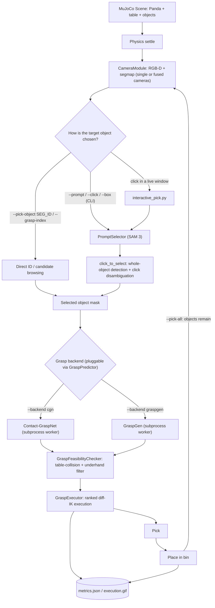
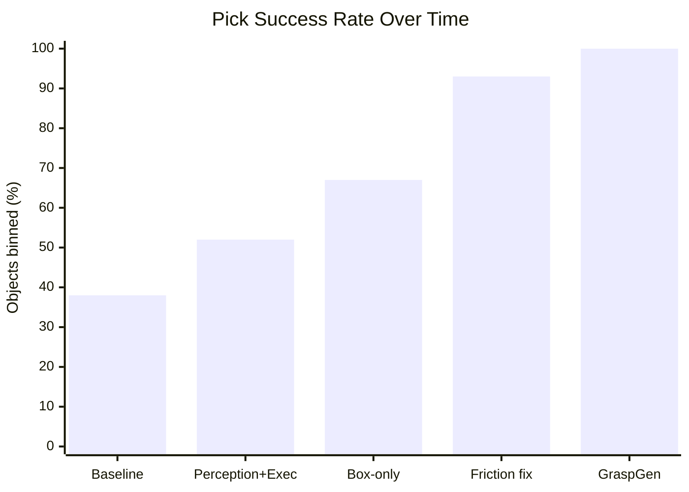

# README Architecture Diagram + Progress Chart Implementation Plan

> **For agentic workers:** REQUIRED SUB-SKILL: Use superpowers:subagent-driven-development (recommended) or superpowers:executing-plans to implement this plan task-by-task. Steps use checkbox (`- [ ]`) syntax for tracking.

**Goal:** Add a Mermaid architecture flowchart near the top of the main `README.md` (so a reader immediately understands what the project does and how data flows through it), and a Mermaid `xychart-beta` bar chart of the pick-success-rate progression alongside the existing "Progress at a glance" table.

**Architecture:** Both additions are plain Mermaid code fences (```` ```mermaid ````) inserted directly into `README.md` — GitHub renders these natively, no build step, no new files, no dependencies. Vega/vega-lite was considered and rejected: it only renders in the VS Code "Markdown Preview Enhanced" extension, not on github.com, which is where this README is actually read. Each diagram is rendered locally to a PNG via `@mermaid-js/mermaid-cli` (through `npx`, no permanent install) as the verification step, since there's no automated test suite for documentation and "does the Mermaid syntax actually render" is the only thing worth checking here.

**Tech Stack:** Markdown, Mermaid (GitHub-native rendering), `@mermaid-js/mermaid-cli` via `npx` (local verification only, not a repo dependency).

## Global Constraints

- No automated test suite in this repo. Verification for these tasks is rendering each diagram locally and visually inspecting the output image — there is no other way to "test" a Markdown diagram.
- Commit messages are plain text — never add a "Co-Authored-By: Claude" trailer or similar.
- Do not modify anything in the README outside the two specified insertion points.
- `xychart-beta` is a newer/beta Mermaid feature. If it fails to render locally via mermaid-cli, that is a real finding to report — do not silently fall back to a different chart type without flagging it, since GitHub's bundled Mermaid version might behave differently than the local CLI's.

---

### Task 1: Architecture flowchart near the top of `README.md`

**Files:**
- Modify: `README.md` (insert after the `---` that follows the "Validated 2026-06-10..." line, before `## Demo videos`, around line 10-11)

**Interfaces:**
- Consumes: nothing (first task, no dependencies).
- Produces: nothing consumed by Task 2 (the two tasks touch different, non-adjacent parts of the same file — safe to do in either order, but Task 1 is listed first since it's higher up the file).

- [ ] **Step 1: Render the diagram locally to verify the Mermaid syntax**

Save this to a scratch file and render it — do not skip this even though it feels like "just markdown":

```bash
mkdir -p /tmp/mermaid-check
cat > /tmp/mermaid-check/architecture.mmd << 'EOF'
flowchart TD
    A["MuJoCo Scene: Panda + table + objects"] --> B["Physics settle"]
    B --> C["CameraModule: RGB-D + segmap (single or fused cameras)"]
    C --> D{"How is the target object chosen?"}
    D -->|"--pick-object SEG_ID / --grasp-index"| E["Direct ID / candidate browsing"]
    D -->|"--prompt / --click / --box (CLI)"| F["PromptSelector (SAM 3)"]
    D -->|"click in a live window"| G["interactive_pick.py"]
    G --> F
    F --> H["click_to_select: whole-object detection + click disambiguation"]
    E --> P["Selected object mask"]
    H --> P
    P --> Q{"Grasp backend (pluggable via GraspPredictor)"}
    Q -->|"--backend cgn"| R["Contact-GraspNet (subprocess worker)"]
    Q -->|"--backend graspgen"| S["GraspGen (subprocess worker)"]
    R --> T["GraspFeasibilityChecker: table-collision + underhand filter"]
    S --> T
    T --> U["GraspExecutor: ranked diff-IK execution"]
    U --> V["Pick"]
    V --> W["Place in bin"]
    W -->|"--pick-all: objects remain"| C
    U --> X[("metrics.json / execution.gif")]
    W --> X
EOF
npx -y @mermaid-js/mermaid-cli -i /tmp/mermaid-check/architecture.mmd -o /tmp/mermaid-check/architecture.png -b white
```

Expected: the command completes without error and produces `/tmp/mermaid-check/architecture.png`. Open the PNG and visually confirm: every node is present, no overlapping/cut-off text, arrows point in the directions described above (scene → camera → object selection branching three ways → merge → backend choice → feasibility → execution → pick → place, with a loop-back edge from "Place in bin" to "CameraModule" labeled `--pick-all: objects remain`, and two edges into the `metrics.json / execution.gif` cylinder node).

If rendering fails or the image looks wrong (overlapping text, missing nodes, arrows going the wrong way), fix the `.mmd` syntax and re-render before proceeding — do not insert unverified Mermaid into the README.

- [ ] **Step 2: Insert the diagram into `README.md`**

Find this exact block (near the top of the file):

```markdown
**Validated 2026-06-10 on laptop (GTX 1650, 4 GB):** test scene 7 → 222 grasps /
8 objects, 2.82 GB peak VRAM, ~48 s. Expect ~1–2 s total on the lab RTX 5090.

---

## Demo videos
```

Replace it with (adding an "## Architecture" section between the existing `---` and `## Demo videos`):

```markdown
**Validated 2026-06-10 on laptop (GTX 1650, 4 GB):** test scene 7 → 222 grasps /
8 objects, 2.82 GB peak VRAM, ~48 s. Expect ~1–2 s total on the lab RTX 5090.

---

## Architecture



Two entry points share this same pipeline: `run_sim_grasp_test.py` (CLI —
`--pick-object`/`--grasp-index`/`--prompt`/`--click`/`--box`, single-shot
`--execute` or looping `--pick-all`) and `interactive_pick.py` (a live camera
window — click an object, confirm the SAM 3 mask, watch it get picked and
placed, one object per run).

---

## Demo videos
```

- [ ] **Step 3: Check for errors and commit**

Run `get_errors` on `README.md` (should find nothing — it's markdown, this
just confirms no tool flags a problem), then:

```bash
git add README.md
git commit -m "Add Mermaid architecture diagram to README"
```

---

### Task 2: Progress chart in the "Progress at a glance" section

**Files:**
- Modify: `README.md` (insert immediately after the "Progress at a glance" section's intro paragraph, before its existing table)

**Interfaces:**
- Consumes: nothing from Task 1.
- Produces: nothing (last task in this plan).

- [ ] **Step 1: Render the chart locally to verify the Mermaid syntax**

```bash
cat > /tmp/mermaid-check/progress.mmd << 'EOF'
xychart-beta
    title "Pick Success Rate Over Time"
    x-axis ["Baseline", "Perception+Exec", "Box-only", "Friction fix", "GraspGen"]
    y-axis "Objects binned (%)" 0 --> 100
    bar [38, 52, 67, 93, 100]
EOF
npx -y @mermaid-js/mermaid-cli -i /tmp/mermaid-check/progress.mmd -o /tmp/mermaid-check/progress.png -b white
```

Expected: either (a) it renders — open the PNG and confirm a bar chart with
5 bars reading 38, 52, 67, 93, 100 from left to right, x-axis labels
"Baseline", "Perception+Exec", "Box-only", "Friction fix", "GraspGen", or
(b) the mermaid-cli version bundled with `npx` doesn't yet support
`xychart-beta` and errors out. If (b), report this as a finding (per this
plan's Global Constraints) rather than silently swapping to a different
chart type — the controller will decide whether to proceed anyway (GitHub's
own Mermaid version may differ from the CLI's) or fall back to the plain
table only.

- [ ] **Step 2: Insert the chart into `README.md`**

Find this exact block:

```markdown
## Progress at a glance

Real, measured numbers recorded as the project went — full detail (per-seed
breakdowns, A/B methodology, taxonomy) lives in `ROADMAP.md`.

| Date | Milestone | Result |
```

Replace it with:

```markdown
## Progress at a glance

Real, measured numbers recorded as the project went — full detail (per-seed
breakdowns, A/B methodology, taxonomy) lives in `ROADMAP.md`.



| Date | Milestone | Result |
```

- [ ] **Step 3: Check for errors, clean up, and commit**

Run `get_errors` on `README.md`, then remove the scratch files:

```bash
rm -rf /tmp/mermaid-check
git add README.md
git commit -m "Add Mermaid progress chart to README"
```
